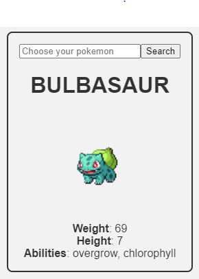

# A hook for data fetching in React

## Introduction

In this post, I will go through the process of creating a [custom hook](https://reactjs.org/docs/hooks-custom.html) for data fetching in React.

I expect that you are familiar with React and the hook API, specifically [useState](https://reactjs.org/docs/hooks-state.html), [useEffect](https://reactjs.org/docs/hooks-effect.html) and [useReducer](https://reactjs.org/docs/hooks-reference.html#usereducer).

If not, you must want to check out the [doc](https://reactjs.org/docs/hooks-intro.html) before.

In addition, the hook we'll build is a mean to exercise and get inspiration more than an adapted version to the specific problem you may encounter in a real world project.

## Building the custom hook

The hook we'll build addresses a task we often have to do in web apps: fetching data.

In this example, we'll fetch data from the PokéAPI and render some information about specific pokemons on the screen.

By the end of that tutorial, we'll have something that looks like this:



Let's quickly setup our app and the JSX it will render.

Don't bother too much about it, that's not the interesting part. I just put it here to  give context:

```js
// ...imports

export default function App() {
  // ==========================================

  // Where we gonna do the interesting stuff

  // ==========================================
  if (isLoading) return <div>Loading...</div>;
  if (err) return <div>{err.toString()}</div>;
  return (
    <div className="App">
      {data && (
        <div className="poke-card">
          <form onSubmit={handleSubmit}>
            <input
              ref={inputRef}
              type="text"
              id="poke-input"
              name="poke-input"
              placeholder="Choose your pokemon"
            />
            <button>Search</button>
          </form>
          <h1>{data.name.toUpperCase()}</h1>
          
          <div>
            <strong>Weight</strong>: {data.weight}
          </div>
          <div>
            <strong>Height</strong>: {data.height}
          </div>
          <div>
            <strong>Abilities</strong>: {formatAbilities(data.abilities)}
          </div>
        </div>
      )}
    </div>
  );
}
```

The entry point for data coming from the user is the input.

It will receive a pokemon name which will be the endpoint of the PokeAPI url we gonna request.

Like you may have seen, the input is in a form that has an `onSubmit` handler which I called `handleSubmit`.

To get the input value inside `handleSubmit`, I use a React feature called `ref`.

It allows my to keep a reference of the input without the need to reach the DOM with the classic `document.querySelector(selector)`

Because it's a side effect, I would need to put it in a `useEffect` hook.

(Learn more about `refs` [here](https://reactjs.org/docs/refs-and-the-dom.html).)

Let's add the code:

```js
// ...imports

// base url of the PokeAPI
const baseUrl = 'https://pokeapi.co/api/v2/pokemon/';

export default function App() {
  const [endPoint, setEndPoint] = useState('pikachu');

  const inputRef = useRef(null);

  function handleSubmit(e) {
    e.preventDefault();

    setEndPoint(inputRef.current.value);
  }

  // ...
  return (
    // ...
  );
}
```

Here, I defined `endPoint` as a state variable with `useState`.

Then we update it with the input value at the time the user submit the form, that is when he clicks the button "Search".

Ok. Now that interaction with the user is setup, we have to actually fetch the data we want from the API.

Because this task is asynchronous and thus, may take time, we must do it in a `useEffect` hook in order to let the browser paint even if the data isn't there yet.

Let's do that using the [fetch API](https://developer.mozilla.org/en-US/docs/Web/API/Fetch_API):

```js
// ...imports

// base url of the PokeAPI
const baseUrl = 'https://pokeapi.co/api/v2/pokemon/';

export default function App() {
  const [endPoint, setEndPoint] = useState('pikachu');
  const [data, setData] = useState(null);

  useEffect(() => {
    const fetchData = async () => {
      const pokeData = await fetch(baseUrl + endPoint);
      setData(pokeData);
    }

    fetchData();
  }, [endPoint])

  // ...
  return (
    // ...
  );
}
```

I introduced a new state variable called `data` to store what we receive from the API and use it in the JSX that the app renders.

When the promise returned by `fetch` is fulfilled, we update the `data` state using `setData`, which will trigger a re-render of the App component and thus, returns a UI with the updated data.

Finally, `useEffect` as `endPoint` as dependency so that it's re-executed only when `endPoint` changes.

But there's something we missed here.

What do we show to the user when the data is not there ?

And what happens if the request fails ?

An error will be thrown and the user will have no feedback about it.

So we need to catch the error and put it in a state variable in order to adapt the response we give to our user.

In addition, we'll use a state variable to track the loading state:

```js
// ...imports

// base url of the PokeAPI
const baseUrl = 'https://pokeapi.co/api/v2/pokemon/';

export default function App() {
  const [endPoint, setEndPoint] = useState('pikachu');
  const [data, setData] = useState(null);
  const [err, setErr] = useState(null);
  const [isLoading, setIsLoading] = useState(false);

  useEffect(() => {
    const fetchData = async () => {
      setIsLoading(true);
      try {
        const pokeData = await fetch(baseUrl + endPoint);
        setData(pokeData);
        setIsLoading(false);
      } catch (err) {
        setErr(err);
        setIsLoading(false);
      }
    }

    fetchData();
  }, [endPoint])

  // ...
  return (
    // ...
  );
}
```

We have done a good job so far !

But there's still a bug that can happen. Did you see it ?

This one is hard to find.

Imagine the component is unmounted or re-rendered before the data arrives.

The `useEffect` callback will try to call `setData` (or `setErr`) whereas there's no more state variable.

In the browser console, you will see something like this:


To handle this gotcha, we need a way to tell `useEffect` to not call `setData` (or `setErr`) if the component has been unmounted or re-rendered.

But how will we do that ?

Well, the `useEffect` callback can return a function that's called after the component is unmounted. In the case it is re-rendered, the function is called right after the next render, but before that the new `useEffect` version runs.

Thus, we can use a flag (`didCancel`) that we'll reverse by calling the returned function, which will inform us about if the component has been unmounted or re-rendered when `useEffect` will be called:

```js
// ...

export default function App() {
  // ...
  useEffect(() => {
    let didCancel = false;

    const fetchData = async () => {
      setIsLoading(true);
      try {
        const pokeData = await fetch(baseUrl + endPoint)
        if (!didCancel) {
          setData(pokeData);
          setIsLoading(false);
        }
      } catch (err) {
        if (!didCancel) {
          setErr(err);
          setIsLoading(false);
        }
      }
    }

    fetchData();

    return () => {
      didCancel = true;
    }
  }, [endPoint])

  // ...
}
```

Finally, we can make a last little improvement by merging the `err` and `isLoading` states into a single object that we'll update with a reducer.

But why would it be an improvement ?

In cases where you find yourself writing multiple `setSomething` together, that might be the sign that these states are related. So it makes sense to group them which can reduce complexity.

In our example, `err` and `isLoading` states can be classed as `fetchState`s.

So let's implement that with `useReducer`:

```js
// ...

function fetchReducer(state, action) {
  switch (action.type) {
    case 'FETCH_INIT':
      return {
        isLoading: true,
        err: null
      };
    case 'FETCH_SUCCESS':
      return {
        isLoading: false,
        err: null
      };
    case 'FETCH_FAILURE':
      return {
        isLoading: false,
        err: action.payload.err
      };
    default:
      throw new Error('Unexpected action type');
  }
}

const initialState = {
  isLoading: false,
  err: null
};

export default function App() {
  const [data, setData] = useState(null);
  const [fetchState, dispatch] = useReducer(fetchReducer, initialState);

  useEffect(() => {
    let didCancel = false;

    async function fetchData() {
      try {
        dispatch({ type: 'FETCH_INIT' });
        const res = await fetch(url);
        const data = await res.json();
        if (!didCancel) {
          setData(data);
          dispatch({ type: 'FETCH_SUCCESS' });
        }
      } catch (err) {
        if (!didCancel) {
          dispatch({ type: 'FETCH_FAILURE', payload: { err } });
        }
      }
    }

    fetchData();

    return () => {
      didCancel = true;
    }
  }, [endPoint])

  // ...
}
```

In the snippet above, I've added a reducer called `fetchReducer` and a `initialState`.

I've put them outside the App component because they don't rely on any prop or state, so it's unnecessary to recompute them each time the component re-renders.

Now, instead of calling `setErr` and `setIsLoading`, we just dispatch an action object with a certain type property and an optional payload containing information that might be relevant to update the state.

Take the time to read the code in order to grasp what happens.

Cool, we have finished !

> What ? But where's the custom hook ? I don't see any `useFetch` thing...

Hehe 😏, I'm joking...

The final step is pretty trivial. We've all the stateful logic so now, we just have to put it into it's own function, which will be our custom hook.

When I say "stateful" logic, I mean all the things that deal with state, i.e the `useState`, `useEffect` and `useReducer`.

Here's the full code:

```js
// useFetch.js
import { useState, useEffect, useReducer } from 'react';

function fetchReducer(state, action) {
  switch (action.type) {
    case 'FETCH_INIT':
      return {
        isLoading: true,
        err: null
      };
    case 'FETCH_SUCCESS':
      return {
        isLoading: false,
        err: null
      };
    case 'FETCH_FAILURE':
      return {
        isLoading: false,
        err: action.payload.err
      };
    default:
      throw new Error('Unexpected action type');
  }
}

const initialState = {
  isLoading: false,
  err: null
};

function useFetch(url) {
  const [data, setData] = useState(null);
  const [fetchState, dispatch] = useReducer(fetchReducer, initialState);

  useEffect(() => {
    let didCancel = false;

    async function fetchData() {
      try {
        dispatch({ type: 'FETCH_INIT' });
        const res = await fetch(url);
        const data = await res.json();
        if (!didCancel) {
          setData(data);
          dispatch({ type: 'FETCH_SUCCESS' });
        }
      } catch (err) {
        if (!didCancel) {
          dispatch({ type: 'FETCH_FAILURE', payload: { err } });
        }
      }
    }

    fetchData();

    return () => {
      didCancel = true;
    };
  }, [setData, dispatch, url]);

  // Here we return the states that we want to expose to our App component
  return { data, ...fetchState };
}

export default useFetch;

// ======================================================================================

// App.js

import React, { useState, useRef } from 'react';
import useFetch from './useFetch.js';

// Helper to format what's shown
function formatAbilities(abilities) {
  const abilitiesList = abilities.reduce((acc, abilityObj) => {
    return [...acc, abilityObj.ability.name];
  }, []);
  return abilitiesList.join(', ');
}

const baseUrl = 'https://pokeapi.co/api/v2/pokemon/';

export default function App() {
  const [endPoint, setEndPoint] = useState('pikachu');

  // ============================================
  // Here's where we call useFetch !

  const { data, isLoading, err } = useFetch(baseUrl + endPoint);

  // ============================================

  const inputRef = useRef(null);

  function handleSubmit(e) {
    e.preventDefault();

    setEndPoint(inputRef.current.value);
  }

  if (isLoading) return <div>Loading...</div>;
  if (err) return <div>{err.toString()}</div>;
  return (
    <div className="App">
      {data && (
        <div className="poke-card">
          <form onSubmit={handleSubmit}>
            <input
              ref={inputRef}
              type="text"
              id="poke-input"
              name="poke-input"
              placeholder="Choose your pokemon"
            />
            <button>Search</button>
          </form>
          <h1>{data.name.toUpperCase()}</h1>
          
          <div>
            <strong>Weight</strong>: {data.weight}
          </div>
          <div>
            <strong>Height</strong>: {data.height}
          </div>
          <div>
            <strong>Abilities</strong>: {formatAbilities(data.abilities)}
          </div>
        </div>
      )}
    </div>
  );
}
```

Now we're done ! 😄

See final version running [here](https://codesandbox.io/s/usefetch-11sps).

For those who are into TypeScript, I've done a [typed version](https://codesandbox.io/s/usefetch-with-typescript-14llq). But I encourage you to do it on your own to practice.

## Conclusion

Like I said in the introduction, you may need to tweak the API of that hook in order to fit your specific use case and your preferences.

Anyway, I hope that it lightens the horizon of things you thought you can do with custom hooks.

As an intermediate user of custom hooks, I always feel overwhelmed by the huge power they give.

For sure, they offer a realm of appealing abstractions but at the end of the day, I think that one must strive to find the best and simplest solution to its specific problem rather than forcing the use of custom hooks.

What I mean is that if a block of stateful logic is not that big or complicated, and that it's used only in one or two components, don't bother with creating a custom hook for it.

Personally, I was so excited by them that I would directly try to think of a custom hook that would solve my problem.

But I changed my approach by doing things step by step, first using built-in hooks and then extract a block of stateful logic if needed, like we did in this post.

That's it ! I'm eager to read your comments and see the tweaked versions you may have built on your own !

## Inspirations and further resources

This post is highly inspired by this [article](https://www.robinwieruch.de/react-fetching-data) of Robin Wieruch.

If you want to go deeper into React in general, I highly recommend his [blog](https://www.robinwieruch.de/blog) as well as the [one](https://overreacted.io/) of Dan Abramov, a core developer of the React team.

Anyway, I believe the only source of truth is the documentation (unless it sucks..., which must question you about if you should use the tool concerned. But don't worry, the React doc is really great. The ecosystem is really mature, you will have no problem to find what you need.). So check [it](https://reactjs.org/) out.