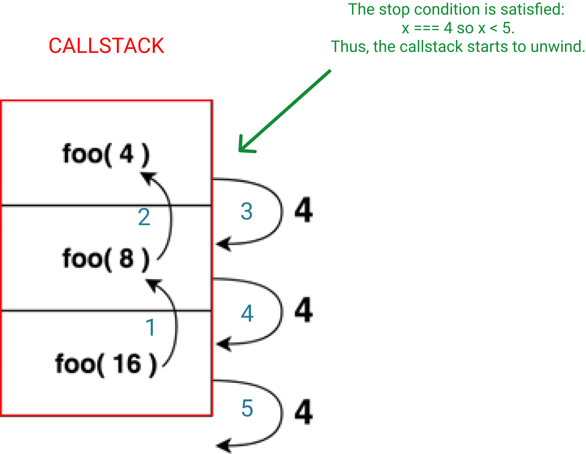

<ToC toc={props.toc} />

## Introduction

In this post, I will explain why _declarative_ code is better than _imperative_ code.

Then I will list some techniques to convert imperative JavaScript to a declarative one in common situations, defining key terms along the way.

## Why declarative ?

First, let's define what _declarative_ and _imperative_ mean.

_Declarative_ code is one that highlights the intent of what it's doing.

It favors the "what" over the "how".

In other words, the exact implementations actually doing the work (aka the "how") are hidden in order to convey what that work actually is (aka the "what").

At the opposite, _imperative_ code is one that favors the "how" over the "what".

Let's see an example:

The snippet below perform two things: it computes the square of `x`, then check if the result is even or not.

```js
// imperative way

const x = 5;

const xSquared = x * x;

let isEven;

if (xSquared % 2 === 0) {
  isEven = true;
} else {
  isEven = false;
}
```

Here, we can see that we finally get `isEven` after several steps that we must follow in order.

These steps describe "how" we arrive to know if the square of `x` is even, but that's not obvious.

If you take a non-programmer and show him this, he might have a hard time deciphering it.

Now let's see another snippet where I introduce a magic `isSquareEven` function that performs the two same things than the previous one.

```js
// declarative way

isSquareEven(5);
```

Much more concise right ?

The result we'll get is obvious because of the name of the function.

Even a non-programmer could easily understand.

But I'm cheating. I used a magic function.

We don't see "how" it actually works.

And that's a good thing because that frees us time, energy and memory to focus on what the piece of code does at the end of the day.

If we just want to use it, that's ideal.

But if we're curious, we still have the possibility to be by going to the definition of the function. (most editors allows you to jump to it easily)

So let's see the implementation of `isSquareEven` (the "how"):

```js
// declarative way

const isSquareEven = (x) => ((x * x) % 2 === 0 ? true : false);
```

The fundamental building blocks of _declarative_ code are functions.

In JavaScript, they have the particularity to be "first-class".

Which means that we can use them as normal data structures like numbers, strings etc.

In other words, you can store a function in a variable. You can pass a function as argument to another function. And a function can return another function.

So now that we have defined these two terms, it's easier to see in what _declarative_ code is better than _imperative_ code.

> _Declarative_ code is more readable.

Like we saw, it's way more concise and easier to understand.

In the previous example, we didn't deal with that much code so both snippets were easily understandable.

But you can imagine that a real project contains more code, and thus, more complexity.

So optimizing the readability will be more and more helpful as the codebase grows, and that's even more important if multiple persons work on it.

> _Declarative_ code is reusable. (because it often implies functions)

You may have noticed in the first snippet (_imperative_ one) that the value of `x` is hard-coded at the beginning.

If we don't do this, the following lines cannot work.

Instead, when we use a function like in the _declarative_ snippet, we can _reuse_ the logic for any input, as long as it is a number.

## Techniques

These techniques concern control flow statements: if/else, while, for loops.

These are imperative.

They describe how the work is done instead of what it is.

As a general guideline, you can simply abstract a piece of logic into a function with a descriptive name in order to make your code more declarative.

But when it comes to control flow statements, what to do is less obvious.

### If/else statements

Sometimes, `if/else` statements are pretty explicit and short so I would argue that staying with them is, in this case, legitimate.

But other times, their conditions are less obvious and/or longer.

So we might abstract them out into functions with declarative names.

For example, let's say we want to check if an object is empty:

```js
// imperative way

const o = { a: 1 }; // can be whatever object

if (Object.keys(o).length === 0) {
  console.log("Object is empty.");
} else {
  console.log("Object is not empty.");
}
```

In JavaScript, there's no easy way to determine if an object is empty.

You may be inclined to do this:

```js
// imperative way

const o = { a: 1 }; // can be whatever object

if (o === {}) {
  console.log("Object is empty.");
} else {
  console.log("Object is not empty.");
}
```

But the condition will evaluate to false, because when using the `==` or `===` signs with objects (including arrays, functions, classes), they're compared by reference, not by equality of their properties.

If you're not familiar with this mechanism, explore [this](http://adripofjavascript.com/blog/drips/object-equality-in-javascript.html).

Going back to our example, it takes a bit of time realising that `Object.keys(o).length === 0` is a trick to check if an object is empty or not.

So we might facilitate this by encapsulating it in a function:

```js
// declarative way

const isEmpty = (o) => Object.keys(o).length === 0;
```

Now we want to log "Object is empty." or "Object is not empty." based on the result.

Instead of using an `if/else` statement, we can use a _ternary expression_.

The difference between the two, apart from the syntax, boils down to the difference between a _statement_ and an _expression_.

A _statement_ evaluates to nothing whereas an _expression_ always evaluates to a value.

So we can treat an expression as a value, which means that we can store it in a variable, pass it into a function etc.

You can't do that with an `if/else` statement, for example:

```js
// INVALID !!!
let variable =
  if (Object.keys(o).length === 0) {
    console.log("Object is empty.");
  } else {
    console.log("Object is not empty.");
  }
```

Finally, converting our first _imperative_ snippet into a _declarative_ one using a function and a _ternary expression_:

```js
// declarative way

const o = { a: 1 }; // can be whatever object

const isEmpty = (o) => Object.keys(o).length === 0;

// function  -------------------- argument -----------------------
console.log(isEmpty(o) ? "Object is empty." : "Object is not empty");
//          condition    ----- then ------     ----- else ------
```

You might put the result of the _ternary expression_ into a variable for even more readability and/or to reuse it later.

```js
// declarative way

const o = { a: 1 }; // can be whatever object

const isEmpty = (o) => Object.keys(o).length === 0;

const message = isEmpty(o) ? "Object is empty." : "Object is not empty";

console.log(message);
```

### For loops

When you're tempted to use a `for` loop, you can use [map](https://developer.mozilla.org/en-US/docs/Web/JavaScript/Reference/Global_Objects/Array/map) or [forEach](https://developer.mozilla.org/en-US/docs/Web/JavaScript/Reference/Global_Objects/Array/forEach) instead.

You might need to convert your data into an array if it isn't already because those functions only apply on it.

For example, you can use [Object.entries()](https://developer.mozilla.org/en-US/docs/Web/JavaScript/Reference/Global_Objects/Object/entries) to get an array of key-value pairs sub-arrays from an object.

Then, after the mapping, you can convert back your result into an object with [Object.fromEntries()](https://developer.mozilla.org/en-US/docs/Web/JavaScript/Reference/Global_Objects/Object/fromEntries).

`forEach` is usually used for side-effects while `map` must be pure.

In other words, you use `map` when you need to get an array back whereas you use `forEach` if you want to perform some action(s) but don't care if it returns something or not.

That's why `forEach` returns `undefined`.

Here's an example of what I said:

```js
// imperative way (aka with for loops)

const persons = [
  { firstname: "John", lastname: "Doe", age: 32 },
  { firstname: "Francesca", lastname: "Miller", age: 25 },
  { firstname: "Paul", lastname: "Bolton", age: 55 },
  { firstname: "Carol", lastname: "Oliver", age: 43 },
];

let presentations = [];

for (let i = 0; i < persons.length; i++) {
  presentations.push(
    `${persons[i].firstname} ${persons[i].lastname} is ${persons[i].age}.`
  );
}

for (let i = 0; i < presentations.length; i++) {
  console.log(presentations[i]);
}
```

Now let's see what it gives us with `map` and `forEach`:

```js
// declarative way

const persons = [
  { firstname: "John", lastname: "Doe", age: 32 },
  { firstname: "Francesca", lastname: "Miller", age: 25 },
  { firstname: "Paul", lastname: "Bolton", age: 55 },
  { firstname: "Carol", lastname: "Oliver", age: 43 },
];

// use map because we want to compute a new array
const presentations = persons.map(
  (person) => `${person.firstname} ${person.lastname} is ${person.age}.`
);
// [
//   "John Doe is 32",
//   "Francesca Miller is 25",
//   "Paul Bolton is 55",
//   "Carol Oliver is 43",
// ]

// use forEach because only concerned by the action of logging
presentations.forEach((presentation) => console.log(presentation));
// undefined
```

We could achieve the same result simply by creating the "presentation" string inside the `forEach` callback and logging it right after, but I wanted to show the use cases of both `map` and `forEach`.

Now you might say:

> Ok. But what if I want, let's say, the sum of all ages ?

With a `for` loop, that's pretty straightforward:

```js
const persons = [
  { firstname: "John", lastname: "Doe", age: 32 },
  { firstname: "Francesca", lastname: "Miller", age: 25 },
  { firstname: "Paul", lastname: "Bolton", age: 55 },
  { firstname: "Carol", lastname: "Oliver", age: 43 },
];

let sumOfAges = 0;

for (let i = 0; i < persons.length; i++) {
  sumOfAges += persons[i].age;
}
```

What how to implement that with `map` ?

We can't because it always gives us an array and here, we want a number.

Now we need another function: `reduce`:

```js
const persons = [
  { firstname: "John", lastname: "Doe", age: 32 },
  { firstname: "Francesca", lastname: "Miller", age: 25 },
  { firstname: "Paul", lastname: "Bolton", age: 55 },
  { firstname: "Carol", lastname: "Oliver", age: 43 },
];

const sumOfAges = persons.reduce((total, person) => total + person.age, 0);
```

I'm not gonna explain how `reduce` works here but that's quite a powerful tool you must learn because it's just... amazing. (I'll put some resources at the end of the post if you want to.)

Anytime you want to compute whatever (an other array, an object, a number, a string etc.) from an array, you can use it.

In fact, you can implement `map`, `filter`, `slice` and certainly other "declarative" functions with it.

That's why it's harder to grasp at the beginning.

But is there a non-trivial instrument that needs no learning before producing beautiful musics with ?

I don't think so.

Like I mentionned, there are other handy functions like `filter` and `slice` that can replace `for` loops to do specific tasks. (Again, the ressources are at the end of the post.)

Ok ! Let's tackle the last technique.

### While loops

While loops can be replaced by recursion, more precisely, recursive functions.

What the heck is that ?

Well. A recursive function has two caracteristics:

1. It calls itself (recursive case).
2. It as a stop condition (base case) that, when satisfied, unwinds the callstack and eventually returns the wanted value.

Let's see an example:

```js
const foo = (x) => {
  if (x < 5) return x; // stop condition
  return foo(x / 2); // calls itself
};

foo(16); // 4
```

Here's a visualization of what happens:



Each black arrow can be replaced by "returns".

The whole process explained literally:

1. foo(16): x === 16 so x > 5, thus we return `foo(16 / 2)`. So we call it and will return whatever this call returns.
2. foo(8): x === 8 so x > 5, thus we return `foo(8 / 2)`. So we call it and will return whatever this call returns.
3. foo(4): x === 4 so x < 5, the stop condition is satisfied. Thus we return 4.
4. Going back to step 2, we wanted to return whatever `foo(8 / 2)` (aka foo(4) in step 3) returns. Now we know it's 4, we return 4.
5. Going back to step 1, we wanted to return whatever `foo(16 / 2)` (aka foo(8) in step 2) returns. Now we know it's 4, we return 4.
6. Since the original call was `foo(16)`, we have 4 as result.

The example is rather simple but at the end of the day, every recursive function share the two caracteristics I've listed above.

That's a technique I really struggled to grasp, so if it's your case, don't give up and expose yourself regularly to different learning materials.

Eventually, that should click one day.

Now let's see an example where we convert a while loop into a recursive function:

```js
// imperative way

let x = 5;
let factor = x;

while (factor > 1) {
  factor -= 1;
  x *= factor;
}
```

Now, can you tell me what this loop does ?

It computes the factorial of 5.

So at the end, x is 120.

Even in this fairly simple example, it's not obvious what the `while` loop does.

Using a recursive function, we can easily solve this problem by giving it a meaningful name:

```js
// declarative way

const factorial = (x) => (x === 1 ? 1 : x * factorial(x - 1));
```

Beautiful right ?

Try to decompose the function like I did in the previous visualization.

Do it on paper to really engage with the information.

## Going further

- Learning `reduce`:

  - [MDN doc](https://developer.mozilla.org/en-US/docs/Web/JavaScript/Reference/Global_Objects/Array/Reduce)
  - [Fun Fun Function](https://www.youtube.com/watch?v=Wl98eZpkp-c)
  - [Again from Fun Fun Function](https://www.youtube.com/watch?v=gU3wOcpbfCM)

- Learning recursion:

  - [javascript.info](https://javascript.info/recursion)
  - [Fun Fun Function](https://www.youtube.com/watch?v=k7-N8R0-KY4)
  - [All Things JavaScript](https://www.youtube.com/watch?v=py7ZWFjrwEs)
  - [More](https://github.com/getify/Functional-Light-JS/blob/master/manuscript/ch8.md/#chapter-8-recursion)

- `filter`: [MDN doc](https://developer.mozilla.org/en-US/docs/Web/JavaScript/Reference/Global_Objects/Array/filter)

- `slice`: [MDN doc](https://developer.mozilla.org/en-US/docs/Web/JavaScript/Reference/Global_Objects/Array/slice)

In this post, I highlighted the terms _imperative_ and _declarative_, essentially declaring that the later gives us more readable code.

But often those term are used in the context of OOP (often imperative) vs FP (more declarative).

Those are two programming paradigms (that is way of tackling software problems if you will).

FP stands for Functional Programming and OOP for Object-Oriented Programming.

While `for` loops are not an "Object-Oriented" thing specifically, the [higher-order functions](https://medium.com/javascript-scene/higher-order-functions-composing-software-5365cf2cbe99) I introduced (map, reduce etc) are core tools in Functional Programming, for which they're often attributed.

The functional paradigm really interests me and I think you can enjoy learn about it.

In addition to being more declarative, it offers other powerful ideas/features like immutability of data-structures which helps to avoid a whole set of bugs related to mutability.

Unfortunately, JS doesn't provide that out of the box so it's a bit like swimming against the tide to try to enforce it, so you may play around with one that does like [Clojure](https://clojure.org/index).

But they're great resources to learn this paradigm in JavaScript which I recommend because the functional languages are often less popular and with ecosystems of learning materials less mature.

Here are few of them:

- Books:
  - [Functional-Light JavaScript](https://github.com/getify/Functional-Light-JS)
  - [Mostly adequate guide to FP (in JS)](https://github.com/MostlyAdequate/mostly-adequate-guide)
- Videos:
  - [Fun Fun Function playlist](https://www.youtube.com/playlist?list=PL0zVEGEvSaeEd9hlmCXrk5yUyqUag-n84)
- Libraries:
  - [Ramda JS](https://ramdajs.com/)
- [More](https://github.com/stoeffel/awesome-fp-js)

## Conclusion

That's it !

I hope you liked this post and mostly, that it will be useful.

Keep coding ! 😄
