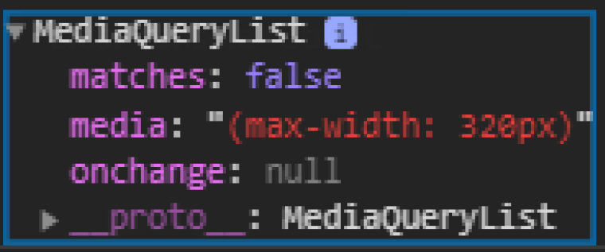
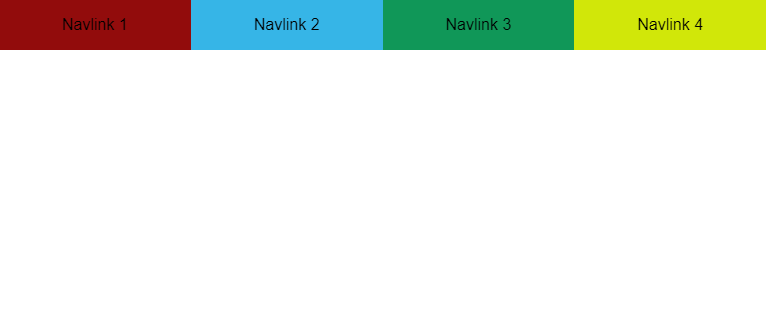
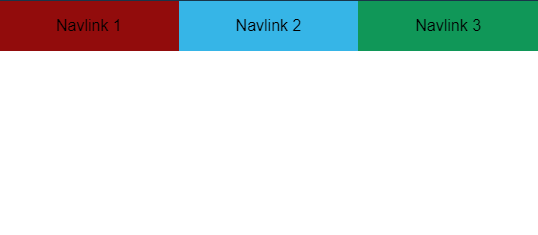

# How to render different components based on screen size

## Introduction

I recently stumble across a pretty sweat JS Web API that I was completely unaware of before.

That API is [Window.matchMedia()](https://developer.mozilla.org/en-US/docs/Web/API/Window/matchMedia).

With it, you can check the window size against a media query and you'll get a boolean: whether `true` if the window size matches your query or `false` otherwise.

You can make the check once are set a listener to dynamically check if the window matches your query.

## Use cases (not exhaustive)

You're may be wondering why we would want to use this API.

We already have CSS media queries to change the style of our page depending on its size.

But in certain cases, you need to render different components based on that size, and CSS can't help you there.

Sometimes also, the amount of style change is so big between the views you want on each side of a breakpoint that you may find simpler to have two different components that are just different by there styles, and then render them depending on the window size.

Let's look at an example to understand it.

## Vanilla JavaScript example

I wanted the capability to render different components based on the screen size in a Svelte project.

If your not familiar with Svelte, that's a JS framework that gather the HTML, CSS and JS for a component in a single .svelte file, which will be compiled before being send to the browser.

Thus, the CSS and JS in such a file are scoped to a block of HTML. The whole is referred as a Svelte component that you can pass around...

The framework adds a few features to JS but the code usually looks like vanilla JS, whereas in a framework like React, because of the way the code is organized, it doesn't look like vanilla JS anymore.

So the example I'll give here is an example implemented in vanilla JS, but if you wonder how to implement that feature in a React app, see [react-media](https://github.com/ReactTraining/react-media). This package was recommended in a reddit thread. I read the doc and it seems pretty cool. In addition, it was made by the creator of [react-router](https://github.com/ReactTraining/react-router), so definitely check it out.

Now, let's dive in the example:

First, I'll create two navbar components to mimic the situation we have in a component based framework:

```js
const Component1 = `
<ul>
  <li>Navlink 1</li>
  <li>Navlink 2</li>
  <li>Navlink 3</li>
</ul>
`;

const Component2 = `
<ul>
  <li>Navlink 1</li>
  <li>Navlink 2</li>
  <li>Navlink 3</li>
  <li>Navlink 4</li>
</ul>
`;
```

The only difference between those two navbars is that the second as one more navlink.

We'll say that we want to render the long navbar (`Component2`) on desktop screens, but on mobile, we decide to remove one navlink because of the size of the screen (we might put that navlink in a hamburger menu for example).

So for the mobile view, we'll render the short navbar (`Component1`).

To render a component, we'll use a little helper to inject the html in the navbar:

```js
const setNavInnerHTML = (html) => {
  const nav = document.querySelector('nav');
  nav.innerHTML = html;
};
```

Now, imagine that our breakpoint is a width of 600px: more is considered desktop view, less or equal is considered mobile view.

We are fully equipped to use `Window.matchMedia()`:

```js
// I'm borrowing the MDN doc notation here: "mql" stands for "media query list".
const mql = window.matchMedia('(max-width: 600px)');

let mobileView = mql.matches;

if (mobileView) {
  setNavInnerHTML(Component1);
} else {
  setNavInnerHTML(Component2);
}
```

Here, we specify our query as a string in the `window.matchMedia()` function, which returns an object of type `MediaQueryList`.

On this object, you can access the property matches which is boolean telling you if the current window size matches your media query.

Pretty simple.

It looks like this:



On this object, you can access the property `matches` which is a boolean telling you if the current window size matches your media query.

However, this example would only work for the first render.

If we want to dynamically adjust the layout, we can set an event listener on the media query list returned, of type `change`:

```js
mql.addEventListener('change', (e) => {
  const mobileView = e.matches;
  if (mobileView) {
    setNavInnerHTML(Component1);
  } else {
    setNavInnerHTML(Component2);
  }
});
```

So on desktop, it will look like this:



And on mobile:



See full code [here](https://codesandbox.io/s/windowmatchmedia-api-73p4x).

## Conclusion

That's it for this quick post.

I hope you discovered a new tool to add in your toolbox, and maybe one day you will need it and use it!

On that, continue coding ;)