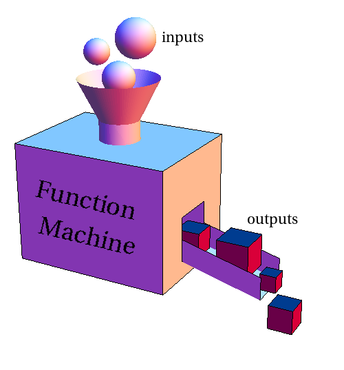
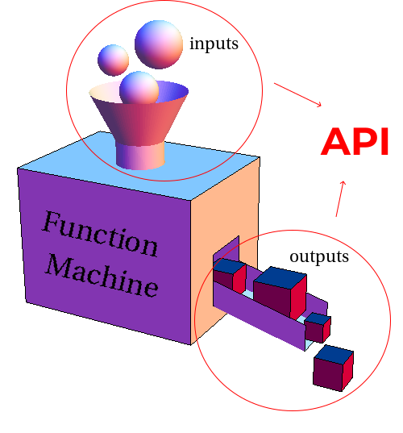

<link rel="stylesheet" type="text/css" media="all" href="./style.css" />

<ToC toc={props.toc} />

## Introduction

I find that the term "API" is used a LOT by people in the software industry. And frankly, I programmed for 1 year and a half without understanding it. That was really frustrating particularly because it's so much used !

But recently, the sky lightened up and I got a boost of motivation to go deeper in what it really means and try to explain it to you.

API stands for "Application Programming Interface".

Well, that's pretty explicit. An API is an interface through which a programmer can interact with an application, i.e a piece of code (more or less big of course).

That seems obvious, right ? Huuuurrrgh... Probably not if you're reading this post. So I'll explain how I think of it with some visualizations and then, give you some examples.

## Visualization

Personally, I think of an API as a function which takes inputs and returns outputs.

I visualize it as an opaque box with a hole at the top where we provide the inputs and an exit on the side where outputs are returned.

<div class="container">
  
</div>

Indeed, a simple function exposes an API. In this case, it's the inputs and the outputs.

<div class="container">
  
</div>

It's like the Function Machine guy said to you:

> Hey ! I can create four cubes. If you want them, you need to give me three spheres.

You have no idea how this guy makes four cubes out of three spheres, but you don't care ! The only thing important here is to know what that function does (outputs) and what you should provide to make it work (inputs).

## A function API

May a simple code example be more concrete:

```ts
function sum(x: number, y: number): number {
  return x + y;
}
```

This code block is written in TypeScript, which is a superset of JavaScript. I used it to be explicit about the type of the inputs the function requires and the output it gives.

We can see that `sum` promises to return a sum if you give it two numbers. Dead simple right ?

Like I said previously, the internals of how the function does its sum are not important. That is, we could hide the code between the curly braces and still use `sum`.

Let's see an example by using `multiply` without knowing its implementation, but just its API.

```js
// multiply API:
// It will give you the product of the two numbers you provided it.

// Cool ! I can use it to do my own stuff !:

function square(x) {
  return multiply(x, x);
}

console.log(square(2));
// 4
```

You see ? We used `multiply` without knowing its implementation !

Ok, you're not dumb... You have certainly guessed that the code inside the function is something like:

```js
// ...
return x * y;
// ...
```

...but you get the point.

With big, complicated functions, you do not know the inside, but you use them. We'll see more complex examples where that's the case.

## API of a library

One case where the term API is used is when you deal with a library. To illustrate, we'll look at a popular JavaScript one: React. That library exposes a global object as an entry point called `React`.

This object has several APIs, that is several methods that produce outputs if we provide the intended inputs.

It looks like this:

```js
const React = {
  createElement,
  createFactory,
  cloneElement,
  isValidElement,
  useState,
  useReducer,
  // ...
};
```

Let's use one of these: useState.

According to the [API documentation](https://reactjs.org/docs/hooks-reference.html#usestate) of useState, it returns a stateful value and a function to update it, together placed in an array. As input, it takes one argument which is the initial state.

For example:

```js
const output = useState(0);
// output: [0, function...]
```

We can use a JS feature called "array destructuring" to directly assign the array values returned by `useState` to their respective variables:

```js
const [state, setState] = useState(0);
// state: 0
// setState: function...
```

Now we can use `setState` to update the state as we want:

```js
setState(1);
// state: 1
// setState: function...
```

So as I said earlier, we don't know anything about the internal code of `useState`. But because we know its API specification, we can use the functionality it offers.

(Note: There are more considerations and possibilities to acknowledge about this method but explaining them is not the purpose of this post.)

## API of a third-party service

Finally, I would like to show another example where API is used, one that implies a third-party service (such as Twitter, Youtube, Google Maps...).

In our example, we'll use OpenWeather. This a platform that collects weather data around the world and exposes an API through which we can request that data.

Here, we need to make a specific HTTP request to get the data we want. The [documentation](https://openweathermap.org/current) says that we must do a call of the form `api.openweathermap.org/data/2.5/weather?q={city name}&appid={your api key}`.

Let's do that:

```js
// assuming we are in a async function

const data = await fetch(
  "https://samples.openweathermap.org/data/2.5/weather?q=London,uk&appid=439d4b804bc8187953eb36d2a8c26a02"
).json();
// data:
// {
//   "coord": {
//     "lon": -0.13,
//     "lat": 51.51
//   },
//   "weather": [
//     {
//       "id": 300,
//       "main": "Drizzle",
//       "description": "light intensity drizzle",
//       "icon": "09d"
//     }
//   ]
//   ...
// }

// do whatever with the data
```

Easy peasy !

Now we can use the data in our application without worrying about how to get it, how to format it etc.

Indeed, it's far less tedious and expensive than creating the data by measuring all the stuff ourselves.

(In fact, I assume that OpenWeather itself rely on other services and APIs to get all that weather data.)

## The power of APIs

APIs are the building blocks of abstraction.

They allow modular programming, that is the ability to leverage functionalities of external pieces of code (so called "modules") in our own codebase.

At the lowest level of abstraction, there are only 0 and 1s. So programmers have added multiple layers of abstraction above in order to focus on what is really important and thus, work more effectively.

Today, every program rely on some sort of abstraction and that's why they get increasingly powerful. Because otherwise, one's human brain would not keep up with all the 0 and 1s that the computer consume at the end of the day.

## Conclusion

That's it!

I hope the article helped you to understand this term.

If you have any comments or suggestion about something, feel free to share it. I would really appreciate it.

I'm eager to deepen my understanding around that subject.

## Sources

- https://fr.wikipedia.org/wiki/Interface_de_programmation
- https://www.youtube.com/watch?v=s7wmiS2mSXY
- https://developer.mozilla.org/en-US/docs/Glossary/API
- https://developer.mozilla.org/en-US/docs/Learn/JavaScript/Client-side_web_APIs/Introduction
- https://en.wikipedia.org/wiki/Application_programming_interface

## Going further

- software architecture: https://en.wikipedia.org/wiki/Software_architecture
- abstraction: https://en.wikipedia.org/wiki/Abstraction_(computer_science)
- designing APIs: https://www.youtube.com/watch?v=_YlYuNMTCc8
